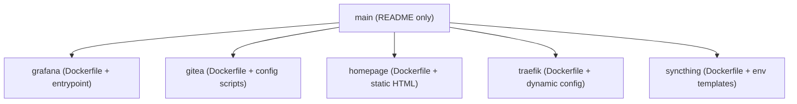
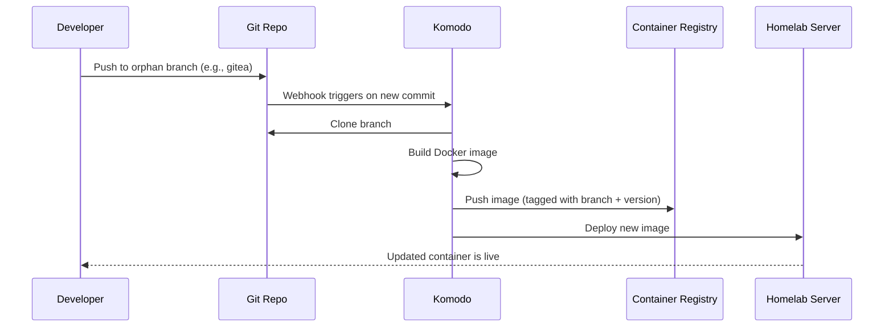
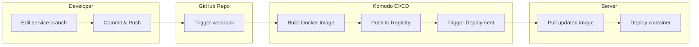

## Modular Images for Your Homelab

This repository is a centralized workspace for building, managing, and deploying custom Docker images across your homelab infrastructure. Each service you maintain has its own isolated orphan branch, containing a minimal, self-sufficient setup: a `Dockerfile`, scripts, and config files placed directly at the branch root.

The main branch hosts only this README. It acts as the entry point to all buildable services. Changes pushed to any service branch are picked up by [Komodo](https://github.com/moghtech/komodo), which takes care of the CI/CD flow — building the image, tagging and pushing it to the container registry, and finally deploying the updated container to the appropriate servers.

---

## 📚 Table of Contents

- [How It Works](#how-it-works)
- [Branch Workflow](#branch-workflow)
- [Requirements](#requirements)
- [Repository Structure](#repository-structure)
- [Build & Deploy Pipeline](#build--deploy-pipeline)
- [Adding a New Service](#adding-a-new-service)
- [End-to-End CI/CD Flow](#end-to-end-cicd-flow)
- [FAQ & Troubleshooting](#faq--troubleshooting)

---

## ⚙️ How It Works

This is not a typical monolithic Dockerfile repo. Each service exists on its own orphan branch. That means the branches don’t share any Git history. This makes each service's context lean, independent, and focused. You can treat any branch like its own micro-repo while still benefiting from centralized tracking and automation.

Here’s what happens after a change:

1. You push updates to an orphan branch (e.g., `grafana`, `gitea`, `traefik`, etc).
2. Komodo detects the new commit.
3. It builds the image using the Dockerfile in the branch root.
4. Tags the image and pushes it to your registry.
5. Komodo (or your configured webhook receiver) updates the container on your servers.

---

## 🌿 Branch Workflow

Each service lives in an **orphan branch**, meaning:

- No `.git` history with other services.
- Files sit at the branch root.
- Fast cloning and building.

Branch names should be:

- lowercase,
- dash-separated,
- clearly indicating the service (e.g., `pihole`, `minio`, `homepage`, `syncthing`).

Komodo watches all branches for new commits. When it sees one, it treats it as a CI/CD trigger.

---

## 📦 Requirements

Your system needs the following:

| Tool     | Purpose                                           | Installation Link                             |
| -------- | ------------------------------------------------- | --------------------------------------------- |
| Git      | Version control                                   | [git-scm](https://git-scm.com/)               |
| Docker   | Image builds and container runtime                | [docker](https://docs.docker.com/get-docker/) |
| Komodo   | GitOps-based CI/CD manager                        | [komodo](https://komo.do/)                    |
| Webhooks | Optional: Trigger Komodo or deploy hook endpoints | Use any HTTP-capable webhook listener         |

> Assumes Ubuntu system. Use `apt install` or follow official docs for each.

---

## 📁 Repository Structure

While the `main` branch contains only the `README.md`, each service is maintained in an **orphan branch**. Here's a high-level view of the structure:



Each orphan branch includes:

- `Dockerfile`: The blueprint for building the image.
- `entrypoint.sh` or `run.sh`: Optional scripts for custom startup logic.
- `config.json`, `settings.yaml`, etc.: Service-specific configuration.
- `.env`, `.dockerignore`: When needed.

All files live at the **root** of their respective branches. No nested folders.

---

## 🚀 Build & Deploy Pipeline



---

## 🆕 Adding a New Service

1. Create a new orphan branch:

   ```bash
   git checkout --orphan <service-name>
   ```

2. Add your files:

   ```bash
   touch Dockerfile
   nano Dockerfile
   ```

3. Commit and push:

   ```bash
   git add .
   git commit -m "Initial commit for <service-name>"
   git push origin <service-name>
   ```

4. Komodo handles the rest.

---

## 🧭 End-to-End CI/CD Flow



---

## ❓ FAQ & Troubleshooting

**Q: What happens if I forget to make an orphan branch?**  
A: You'll pull in history from `main` or another service. Run `git checkout --orphan your-service` to fix it.

**Q: Why isn’t my container updating?**  
A:

- Make sure your branch was pushed to origin.
- Check Komodo’s logs.
- Validate that the Dockerfile doesn’t have build errors.

**Q: Can I use secrets or credentials?**  
A: Yes. Use `.env` or configure secrets directly in Komodo.

**Q: I want to test a Dockerfile locally before pushing.**  
A:

```bash
docker build -t test-image .
docker run -it --rm test-image
```

**Tips:**

- Avoid `latest` tag in Komodo; use `git rev-parse --short HEAD` as the tag.
- Always use relative paths.
- Avoid base images with high CVEs.

---
**THIS REPOSITORY IS ENCRYPTED. IF YOU'RE HERE, YOU'RE EITHER VERY BRAVE OR VERY LOST. EITHER WAY, GOOD LUCK!**
